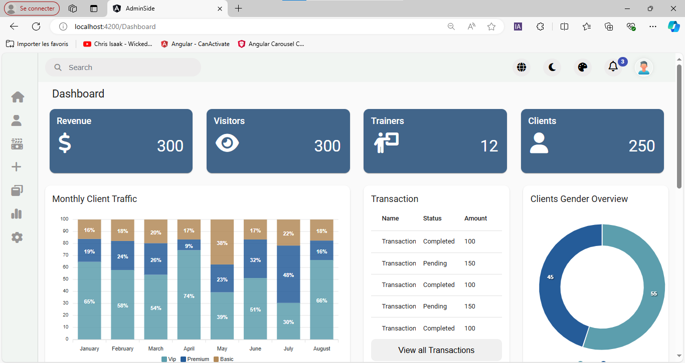

# **Angular Admin Dashboard Project**

Welcome to the **Angular Admin Dashboard Project**, a modern and responsive dashboard application built using Angular, one of the most powerful frameworks for developing dynamic and scalable web applications. This project is designed to provide a robust, flexible, and visually appealing platform that caters to various administrative tasks and data visualization needs.

## **Table of Contents**

- [Project Overview](#project-overview)
- [Demo](#demo)
- [Features](#features)
- [Technology Stack](#technology-stack)
- [Project Structure](#project-structure)
- [Getting Started](#getting-started)
- [License](#license)

## **Project Overview**

This Angular Admin Dashboard serves as a comprehensive solution for managing, analyzing, and visualizing data across different domains. Whether you are looking to monitor business performance, track user engagement, or manage client information, this dashboard offers a seamless experience with intuitive navigation and rich features.

## **Demo**

You can view a live demo of the application by visiting [Demo Link](https://your-demo-url.com). Below is a preview of the dashboard:



## **Features**

## **Features**

- **Dashboard with drag-and-drop customization:** Easily change the position of charts and other elements on the dashboard using drag-and-drop functionality.
- **Dark mode:** Switch to a dark theme for a more comfortable viewing experience in low-light environments.
- **Customizable charts and cards:** Users can change the colors of charts and cards to match their preferences or branding.
- **Multi-language support:** Reach a global audience with built-in support for multiple languages, including English, French, and Spanish.
- **Responsive design:** Ensure your application looks great and functions seamlessly on any device, whether it's a desktop, tablet, or mobile.


## **Technology Stack**

- **Angular:** Leveraging Angular's powerful two-way data binding, dependency injection, and comprehensive tooling.
- **TypeScript:** Ensuring a type-safe environment with TypeScript, enhancing code quality and developer productivity.
- **CSS3:** Styling the dashboard with CSS3, providing a clean and consistent UI while allowing for easy theming and customization.
- **HTML5:** Utilizing HTML5 for a semantic, accessible, and standards-compliant structure.
- **RxJS:** Managing asynchronous data streams with RxJS, enabling efficient and scalable state management.
- **Angular Material:** Implementing responsive and accessible UI components with Angular Material, ensuring a consistent look and feel across the application.
- **PrimeNG:** Utilizing PrimeNG for additional UI components, to enhance the user interface.

## **Project Structure**

The project follows Angular's best practices and recommended folder structure:

- **src/app/modules:** Contains feature modules for different parts of the dashboard.
- **src/app/services** Contains services that are used across the application.
- **src/assets:** Static assets like images, icons, and styles.
- **src/environments:** Configuration files for different environments (development, production, etc.).
- **src/assets/i18n:** Contains translation files for internationalization (i18n) support.

## **Getting Started**

To get started with this project, you have two options: setting it up traditionally via Angular CLI or using Docker. Follow the steps below depending on your preferred method.

### **Option 1: Traditional Setup (Angular CLI)**

1. **Clone the repository:**
   
   ```bash
   git clone https://github.com/your-repository/angular-admin-dashboard.git
2. **Navigate to the project directory:**
   
   ```bash
   cd admin-side
3. **Install dependencies:**
   
   Ensure you have Node.js and npm installed. Then, run:
   
   ```bash
   npm install
   
4. **Serve the application:**
   
   To start a local development server and see your app in action, run:
   
   ```bash
   ng serve
  Open your browser and navigate to http://localhost:4200. The app will automatically reload if you change any of the source files.

### **Option 2: Using Docker Compose**  
  1. **Clone the repository:**
      
     ```bash
     git clone https://github.com/your-repository/angular-admin-dashboard.git

  2. **Navigate to the project directory:**

     ```bash
     cd admin-side
     
  3. **Ensure you have Docker and Docker Compose installed.**
     
  4. **Start the application using Docker Compose:**
     
     To start the application and build the Docker images, run:
     
     ```bash
     docker-compose up --build
     
   Open your browser and navigate to http://localhost:4200. The app will automatically reload if you change any of the source files.
   
  5. **Stop the application:**
   
     To stop the Docker containers, run:
     
     ```bash
     docker-compose down
## **License**

This project is free to use under the MIT License. You are free to use, modify, and distribute this software for any purpose, including commercial applications, as long as you include the original copyright notice and a copy of the license in any distributed versions of the software.

For more details, see the full text of the [MIT License](LICENSE).

---

MIT License
-----------

Copyright (c) 2024 Naoufal

Permission is hereby granted, free of charge, to any person obtaining a copy
of this software and associated documentation files (the "Software"), to deal
in the Software without restriction, including without limitation the rights
to use, copy, modify, merge, publish, distribute, sublicense, and/or sell
copies of the Software, and to permit persons to whom the Software is
furnished to do so, subject to the following conditions:

The above copyright notice and this permission notice shall be included in all
copies or substantial portions of the Software.

THE SOFTWARE IS PROVIDED "AS IS", WITHOUT WARRANTY OF ANY KIND, EXPRESS OR
IMPLIED, INCLUDING BUT NOT LIMITED TO THE WARRANTIES OF MERCHANTABILITY,
FITNESS FOR A PARTICULAR PURPOSE AND NONINFRINGEMENT. IN NO EVENT SHALL THE
AUTHORS OR COPYRIGHT HOLDERS BE LIABLE FOR ANY CLAIM, DAMAGES OR OTHER
LIABILITY, WHETHER IN AN ACTION OF CONTRACT, TORT OR OTHERWISE, ARISING FROM,
OUT OF OR IN CONNECTION WITH THE SOFTWARE OR THE USE OR OTHER DEALINGS IN THE
SOFTWARE.
   


    


   

  


   

   

   
